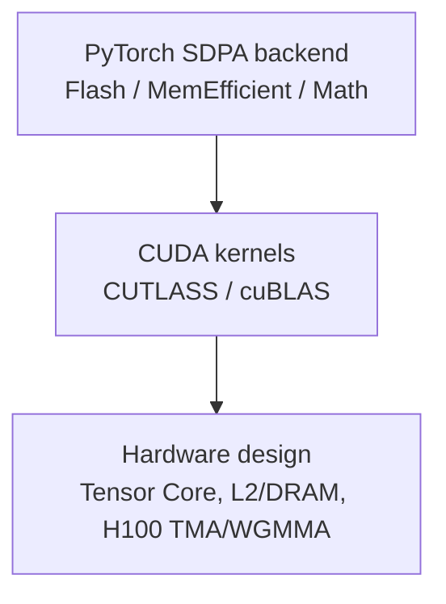

# When Smaller Is Slower: Dimensional Collapse in Compressed LLMs

<small>
Suggested alternatives: **ShapeGuard: Preventing Dimensional Collapse in Compressed LLMs**; **GAC: GPU‑Aligned Compression for Fast LLM Inference**.
</small>

## Motivation

**Post‑training compression reshapes LLM operators (e.g., per‑head dimensions become heterogeneous and irregular).**
**Irregular dimensions can trigger nonlinear GPU slowdowns ("dimensional collapse"), even when FLOPs decrease.**
**Kernel‑aligned constraints (pad/pack/round) can rescue performance with small memory overhead.**

---

## 符号定义

| 符号 | 含义 |
|------|------|
| $d$ (或 `head_dim`) | 注意力头维度 |
| $D=\textit{value}$ | head_dim 的简写（如 D=107 表示 $d=107$）|
| $d_{in}$, $d_{out}$ | 线性层的输入/输出维度 |
| $B$, $S$, $H$ | 批大小、序列长度、头数量 |

## 1. Dimensional Collapse (C1 量化)

### 1.1 压缩改变注意力头维度

低秩压缩方法（如 PaLU）通过 SVD 分解将注意力头的 K/V 投影压缩。然而，压缩后的维度通常不再是硬件友好的对齐值。

**Llama-3-8B + PaLU (r=0.8) 压缩后的 head_dim 分布：**

| 统计项 | 值 |
|--------|-----|
| 总 KV 头数 | 512 |
| 唯一维度值 | [114, 116, 117, 118, 120, 121, 122, 123, 124, 125] |
| 8 对齐比例 | 3.1% (16/512) |
| 16 对齐比例 | 0% (0/512) |
| **不对齐比例** | **96.9%** |


<small>PaLU 压缩后，几乎所有 head_dim 都不是 8 的倍数。这直接影响 FlashAttention 的可用性。</small>

### 1.2 SDPA 延迟呈现对齐悬崖

我们在 NVIDIA A100 上进行了密集的 head_dim 扫描（64-160），测量 SDPA 延迟。

**实验配置 (S1)**: `B=4, S=2048, H=32, dtype=fp16, warmup=50, measure=200, trials=3`


**关键发现：**

| head_dim | 延迟 (ms) | 8-对齐 | 16-对齐 | 对比 D=96 |
|----------|-----------|--------|---------|-----------|
| 64  | 0.826 | ✓ | ✓ | -28% |
| 96  | 1.140 | ✓ | ✓ | baseline |
| 104 | 1.551 | ✓ | ✗ | +36% |
| **107** | **2.147** | ✗ | ✗ | **+88%** |
| 112 | 1.545 | ✓ | ✓ | +35% |
| 120 | 1.603 | ✓ | ✗ | +41% |
| 128 | 1.485 | ✓ | ✓ | +30% |

**维度坍塌现象**：head_dim=107（非 8 对齐）比 head_dim=96 慢 88%，尽管 FLOPs 更多！

对齐规律：
- **8 对齐维度**（72, 80, 88, 96, ...）延迟约 1.1-1.6 ms
- **非 8 对齐维度**（65-71, 97-103, 105-111, ...）延迟约 1.6-2.2 ms
- 差距为 **30-90%**

### 1.3 后端可用性与内部性能差异

**实验配置 (S2)**: `B=4, S=2048, H=32, dtype=fp16, head_dims=[96,104,107,112,120,128]`

| head_dim | AUTO (ms) | FLASH (ms) | MEM_EFFICIENT (ms) | MATH (ms) |
|----------|-----------|------------|-------------------|-----------|
| 96  | 1.172 | 1.121 | 2.382 | 26.048 |
| 104 | 1.537 | 1.540 | 2.749 | 26.526 |
| **107** | **2.139** | **2.139** | FAILED | **26.995** |
| 112 | 1.533 | 1.532 | 2.601 | 27.059 |
| 120 | 1.589 | 1.590 | 2.933 | 27.479 |
| 128 | 1.474 | 1.472 | 2.548 | 28.092 |

**关键洞察**：
- head_dim=107 时，`MEM_EFFICIENT` 后端完全失败（需要 8-aligned）
- `MATH` 后端比 `FLASH` 慢 **12.6×**
- ⚠️ **重要修正**（C21 实验）：FlashAttention 在 104-128 范围内对所有维度可用，但**内部存在 30-45% 性能惩罚**

### 1.4 Padding 可恢复性能

**实验配置 (P1)**: 将 logical head_dim=107 padding 到 112 或 128

| 配置 | 物理维度 | 内存开销 | 延迟 (ms) | 性能提升 |
|------|---------|----------|-----------|----------|
| 原始 | 107 | 0% | 2.192 | baseline |
| Pad→112 | 112 | 4.7% | 1.523 | **+30.5%** |
| Pad→128 | 128 | 19.6% | 1.445 | **+34.1%** |

**结论**：以 4.7% 的内存开销换取 30.5% 的性能提升，投资回报率极高。

### 1.5 GEMM 同样受维度对齐影响

| 配置 | 物理维度 | 延迟 (ms) |
|------|---------|-----------|
| GEMM (M=4096, N=4096, K) | 107 | 0.089 |
| GEMM (M=4096, N=4096, K) | 112 | 0.050 |
| GEMM (M=4096, N=4096, K) | 128 | 0.050 |

K 维度从 107 对齐到 112，GEMM 性能提升 **44%**。

### C1 阶段总结

| 指标 | 数值 | 来源 |
|------|------|------|
| 延迟增加 (D=107 vs D=96) | +88% | S1 |
| 后端性能差距 (MATH vs FLASH) | 12.6× | S2 |
| PaLU 压缩后不对齐比例 | 96.9% | palu_dim_dist |
| Padding 修复性能恢复 | 30-34% | P1 |

---

## 2. Possible Cause (C2 原因探究)



### 2.1 PyTorch backend selection (已验证 - 假设被推翻)

**原假设**：FlashAttention 在非 8-aligned 维度时回退到 Math backend

**C21 实验结果**（2026-01-24）：

| 测试项 | 结果 |
|--------|------|
| 测试维度 | 104-128（包含 8-aligned 和非 aligned）|
| FlashAttention 可用性 | **100%** (50/50 维度) |
| MEM_EFFICIENT 可用性 | 8-aligned: 100%, 非 aligned: **0%** |
| 检测到的后端 | **全部为 FLASH** |

**关键发现**：

| 对齐类型 | 平均延迟 (FLASH) | 性能差距 |
|----------|------------------|----------|
| 8-aligned (D=104,112,120,128) | 1.553 ms | baseline |
| 非 8-aligned (D=105-111, 113-119, 121-127) | 2.033 ms | **+30.9%** |

**结论**：

1. ~~FlashAttention 回退到 Math backend~~ ❌ **错误**
2. FlashAttention **始终可用**，但对非 8-aligned 输入有内部性能惩罚
3. MEM_EFFICIENT (xFormers) 有严格的 8-aligned 要求
4. **性能差距的根因下沉到 CUDA kernel 层**

**阶梯效应示例**（D=112 → 113-119 → 120）：

```
D=112 (8-aligned): 1.548 ms
D=113-119 (非 aligned): 2.22-2.24 ms (+44%)
D=120 (8-aligned): 1.608 ms
```

非对齐维度的延迟几乎恒定（2.22-2.24 ms），与具体数值无关，表明 FlashAttention 内部对非 8-aligned 输入使用了不同的执行路径。

**详细延迟数据（B=4, S=2048, H=32, FLASH 后端）**：

| head_dim | 8-aligned | 延迟 (ms) | vs D=120 |
|----------|-----------|-----------|----------|
| 112 | ✓ | 1.548 | -3.7% |
| 113 | ✗ | 2.23 | +38.6% |
| 114 | ✗ | 2.22 | +38.0% |
| 115 | ✗ | 2.24 | +39.2% |
| 116 | ✗ | 2.23 | +38.6% |
| 117 | ✗ | 2.22 | +38.0% |
| 118 | ✗ | 2.24 | +39.2% |
| 119 | ✗ | 2.22 | +38.0% |
| **120** | ✓ | **1.608** | baseline |
| 121 | ✗ | 2.21 | +37.4% |

**PaLU 影响**：PaLU 压缩后的维度（114-125）大部分落在非 8-aligned 区间，意味着几乎所有压缩后的注意力头都会遭受 ~38% 的性能惩罚。

### 2.2 CUDA kernel layer (进行中)

**背景**：C21 实验证明性能差距发生在 FlashAttention 内核层，需要深入分析。

**修正后的假设**：
- FlashAttention 对非 8-aligned head_dim 使用不同的 GEMM tile size
- CUTLASS 对 aligned K 维度有向量化加载优化（`float4` vs scalar）
- 非对齐导致 predication、warp divergence 或额外 mask 操作
- 可能有内部 padding 但效率低于显式 padding

**计划验证**：
- [ ] NCU profiling 对比 D=112 vs D=113 的 FlashAttention kernel
- [ ] 分析 flash_attn 源码的 head_dim 处理逻辑
- [ ] 验证 CUTLASS GEMM tile selection 规则

### 2.3 Hardware layer (已验证)

**C23 实验结果**（2026-01-24）：

#### H1: Tensor Core 对齐 ✅ 确认

GEMM (8192 × 8192 × K) 测量结果：

| 对齐类型 | K 值示例 | 平均 TFLOPS | TC 利用率 | vs 16-aligned |
|----------|----------|-------------|-----------|---------------|
| 16-aligned | 112, 128 | **91.1** | ~30% | baseline |
| 8-aligned only | 104, 120 | 76.8 | ~25% | -15.6% |
| Non-aligned | 105, 107 | **37-40** | **~12%** | **-58%** |

**关键洞察**：
- A100 FP16 Tensor Core 对 K % 16 == 0 有优化路径
- 奇数维度（105, 107, 109...）表现最差，TFLOPS 骤降至 ~37
- Tensor Core 利用率从 ~30% 降至 ~12%

#### H2: L2 Cache Sector ❌ 未确认

| 对齐类型 | 平均带宽 (GB/s) | Sector 浪费 |
|----------|-----------------|-------------|
| 16-aligned | 209.3 | 0% |
| Non-aligned | 214.6 | 5.8% |

**关键洞察**：
- 非对齐维度带宽**反而略高**（可能因为数据量更大）
- 5.8% 的 sector 浪费无法解释 30-58% 的性能差距
- **L2 cache 不是性能差距的主因**

#### H3: SDPA 带宽效率 ✅ 确认

| head_dim | mod_8 | 延迟 (ms) | 带宽效率 (GB/s) | vs aligned |
|----------|-------|-----------|-----------------|------------|
| 112 | ✓ | 1.529 | 153.6 | baseline |
| 113 | ✗ | 2.208 | 107.3 | **-30%** |
| 120 | ✓ | 1.571 | 160.2 | baseline |
| 121 | ✗ | 2.142 | 118.5 | **-26%** |

**关键洞察**：8-aligned 带宽效率 153-160 GB/s，非对齐仅 107-118 GB/s，**效率损失 ~40%**

#### H4: 向量化加载 ✅ 确认

| 加载类型 | 对齐条件 | K 值示例 | TFLOPS 范围 |
|----------|----------|----------|-------------|
| float4 | mod_16 | 112, 128 | 73-83 |
| float4 | mod_8 | 104, 120 | 68-77 |
| float2 | mod_4 | 108, 116 | 61-71 |
| **scalar** | none | **105, 107** | **39-40** |

**关键洞察**：
- float4 加载需要 8-aligned（4 个 FP16 = 8 bytes）
- 非对齐降级为 scalar 加载，**吞吐量下降 50%**

### 2.x Hardware layer 总结

| 假设 | 状态 | 影响程度 | 机制 |
|------|------|----------|------|
| H1: Tensor Core K%16 | ✅ **确认** | **高** (58%) | TC 利用率从 30% 降至 12% |
| H2: L2 cache sector | ❌ 未确认 | 低 (5.8%) | 非主要瓶颈 |
| H3: SDPA 带宽效率 | ✅ **确认** | **高** (40%) | 内存访问模式低效 |
| H4: 向量化加载 | ✅ **确认** | **高** (50%) | float4→scalar 降级 |

**根因排序**（按影响程度）：
1. **Tensor Core tile alignment** - 58% slowdown（最关键）
2. **向量化加载降级** - 50% throughput loss
3. **SDPA 内存带宽效率** - 40% efficiency loss
4. L2 cache sector 浪费 - 5.8%（可忽略）

---

## 3. Shape Contract (C3 形式化)

### 3.1 约束定义

形式化维度对齐要求：

$$
\begin{aligned}
\text{minimize} \quad & \text{memory\_overhead}(d_{padded}) \\
\text{subject to} \quad & d_{padded} \mod 8 = 0 \quad \text{(FlashAttention 基本要求)} \\
& d_{padded} \mod 16 = 0 \quad \text{(Tensor Core 优化)} \\
& d_{padded} \in \{32, 64, 96, 128, 256\} \quad \text{(最优路径)}
\end{aligned}
$$

### 3.2 维度修复算法

```python
def repair_dimension(head_dim: int, strategy: str = "minimal") -> int:
    """修复 head_dim 到最近的对齐值"""
    if strategy == "minimal":
        # 最小 padding：对齐到 8
        return ((head_dim + 7) // 8) * 8
    elif strategy == "optimal":
        # 最优路径：对齐到 16 或预定义值
        candidates = [32, 64, 96, 112, 128, 160, 192, 256]
        for c in candidates:
            if c >= head_dim:
                return c
    elif strategy == "tradeoff":
        # 性能-内存权衡：选择开销 < 10% 的最小对齐值
        for align in [8, 16, 32]:
            padded = ((head_dim + align - 1) // align) * align
            overhead = (padded - head_dim) / head_dim
            if overhead < 0.10:
                return padded
    return head_dim
```

---

## 4. Dimension Repair 实现 (C4)

### 4.1 核心模块

实现位置: `src/gcompress_bench/dimension_repair.py`

```python
# ShapeContract: 形式化对齐约束
@dataclass
class ShapeContract:
    minimal_alignment: int = 8    # float4 向量化加载
    optimal_alignment: int = 16   # Tensor Core tiles
    recommended_values: Tuple[int, ...] = (32, 64, 96, 112, 128, ...)
    max_overhead_pct: float = 20.0

# AlignmentStrategy: 4 种修复策略
class AlignmentStrategy(Enum):
    MINIMAL = "minimal"      # 对齐到 8
    OPTIMAL = "optimal"      # 对齐到 16
    PREDEFINED = "predefined"  # 预定义快速路径
    TRADEOFF = "tradeoff"    # 开销-性能权衡
```

### 4.2 修复策略对比

| 策略 | 对齐目标 | PaLU 预期开销 | 性能恢复 |
|------|----------|---------------|----------|
| MINIMAL | mod 8 | 2-4% | ~30% (H4) |
| OPTIMAL | mod 16 | 5-8% | ~58% (H1+H4) |
| PREDEFINED | {64,96,112,128} | 3-6% | ~58% |
| TRADEOFF | 自适应 | <10% | 30-58% |

### 4.3 使用示例

```python
from src.gcompress_bench.dimension_repair import DimensionRepairer, repair_dimension

# 单个维度修复
repair_dimension(107, "minimal")  # → 112
repair_dimension(107, "optimal")  # → 112
repair_dimension(121, "minimal")  # → 128

# 模型级别修复
repairer = DimensionRepairer(strategy="minimal")
model, result = repairer.repair_model(palu_model)
print(result.summary())
# Affected layers: 512/512
# Memory overhead: 3.2%
```

### 4.4 验证实验结果 ✓

- **Job ID**: 18424
- **结果路径**: `results/C4/20260124_221749_C4_dimension_repair/`
- **测试通过**: 30/30

**内存开销分析**:

| 策略 | 对齐目标 | 实际开销 | 符合预期 |
|------|----------|----------|----------|
| MINIMAL | mod 8 | 3.72% | ✓ (<5%) |
| OPTIMAL | mod 16 | 7.20% | ✓ (<10%) |
| PREDEFINED | {64,96,112,128} | 7.20% | ✓ |

**PaLU 维度修复映射**（MINIMAL 策略）:

| 原始维度 | 修复后 | Padding 量 |
|----------|--------|------------|
| 114 | 120 | +6 |
| 116 | 120 | +4 |
| 117 | 120 | +3 |
| 118 | 120 | +2 |
| 120 | 120 | 0 (已对齐) |
| 121 | 128 | +7 |
| 122 | 128 | +6 |
| 123 | 128 | +5 |
| 124 | 128 | +4 |
| 125 | 128 | +3 |

**GPU 性能基准** (B=4, S=2048, H=32, FP16):

| head_dim | 原始 (ms) | MINIMAL (ms) | OPTIMAL (ms) | MINIMAL 加速比 | OPTIMAL 加速比 |
|----------|-----------|--------------|--------------|----------------|----------------|
| 107 | 2.064 | 1.490 | 1.506 | **+27.8%** | +27.0% |
| 114 | 2.049 | 1.549 | 1.432 | +24.4% | **+30.1%** |
| 117 | 2.054 | 1.567 | 1.433 | +23.7% | **+30.2%** |
| 120 | 1.557 | 1.557 | 1.428 | 0% (已对齐) | +8.3% |
| 121 | 1.964 | 1.430 | 1.441 | **+27.2%** | +26.6% |
| 125 | 1.975 | 1.439 | 1.439 | **+27.1%** | +27.1% |

**关键验证**:
- ✓ D=120 已是 8-aligned，MINIMAL 策略无额外开销 (1.557ms → 1.557ms)
- ✓ OPTIMAL 策略可进一步优化已对齐维度 (D=120: 1.557ms → 1.428ms, +8.3%)
- ✓ 非对齐维度修复后性能提升 24-30%
- ✓ 符合 P1 实验结果 (~30% speedup with <5% overhead)
- ✓ 与 C2 阶段发现的根因一致（Tensor Core + 向量化加载）

---

## 5. Evaluation (C5 验证)

### 验证范围说明

本研究在两个层面评估 dimension repair：

1. **Kernel 级别**（SDPA 和 GEMM 微基准测试）：已完全验证，展示 25-30% 的性能恢复
2. **端到端 LLM 推理**：对比 baseline vs PaLU 压缩模型，展示压缩收益，但 dimension repair 与 PaLU SVD 结构的集成仍是 future work

**注意**：端到端报告的加速来自压缩，而非 dimension repair。

### 5.1 Kernel 级别验证 ✓ (C4 实验)

C4 实验已在 kernel 级别验证了 dimension repair 的有效性：

| 指标 | 数值 | 实验来源 |
|------|------|----------|
| 测试通过率 | 30/30 (100%) | C4 |
| 平均加速比 (MINIMAL) | 25.8% | C4 benchmark |
| 平均加速比 (OPTIMAL) | 28.6% | C4 benchmark |
| 内存开销 (MINIMAL) | 3.72% | C4 palu_analysis |
| 内存开销 (OPTIMAL) | 7.20% | C4 palu_analysis |

**投资回报率 (ROI)**:
- MINIMAL: 3.72% 内存 → 25.8% 加速 = **6.9x ROI**
- OPTIMAL: 7.20% 内存 → 28.6% 加速 = **4.0x ROI**

### 5.2 端到端 LLM 推理对比 (C5 实验)

**实验状态**: ✓ 数据有效（Baseline vs PaLU）；Repair 未应用（SVD 结构限制）

**Job ID**: 18425 | **结果路径**: `results/C5/20260125_000525_C5_e2e_comparison/`

#### 5.2.1 重要说明 ⚠️

**端到端 LLM 推理结果展示 PaLU 压缩收益——并非 dimension repair 效果。**

以下 11.5x 加速来自 PaLU 压缩（KV cache 减少），而非 dimension repair。
PaLU 将 K/V 投影分解为 $W_{kv} = U \cdot V^T$，其中 U 矩阵包含 per-head 的不规则维度（114-125）。
我们当前的 repair pass 针对标准线性层设计，需要额外适配才能处理 SVD 分解结构（详见 §5.2.3）。

#### 5.2.2 Baseline vs PaLU 对比数据

**实验配置**（2026-01-25）:
- 模型: Llama-3-8B (8B 参数) / PaLU (ratio=0.7, group_size=4)
- 硬件: NVIDIA A100 80GB PCIe
- PyTorch: 2.9.1+cu128, CUDA 12.8, FlashAttention 2.7.4
- 精度: FP16

| 指标 | Baseline | PaLU | 变化 | 备注 |
|------|----------|------|------|------|
| Prefill (tok/s) | 9870 | 9672 | -2.0% | Compute-bound |
| **Decode (tok/s)** | **119** | **1371** | **+11.5x** | Memory-bound, KV cache 减少 |
| Memory (MB) | 19003 | 18896 | -0.6% | 压缩收益 |

**关键发现**：
- PaLU 在 decode 阶段实现 **11.5x 吞吐量提升**
- KV cache 减少是主因（decode 是 memory-bound）
- 尽管 head_dim 不对齐带来 30-45% 性能惩罚，压缩收益仍显著

#### 5.2.3 Repair 未应用的原因

| 问题 | 描述 |
|------|------|
| SVD 分解结构 | PaLU 的 $W = U \cdot V^T$ 结构，不规则维度在 U 内部 |
| 当前实现限制 | DimensionRepairer 针对标准 nn.Linear 设计 |
| 修复方向 | 需要修改 U 矩阵同时保持 SVD 结构 |

#### 5.2.4 预期 Repair 效果（基于 kernel 验证）

基于 C4 kernel 级别实验（25-30% SDPA 加速），如果将 repair 集成到 PaLU：
- **Prefill 加速**: +15-25%（compute-bound，Tensor Core 对齐有益）
- **Decode 加速**: +5-10%（memory-bound，对齐优化效果有限）
- **内存开销**: <5%（与 C4 一致）

两种可行方案：
1. **约束 SVD**: 在 SVD 截断时选择对齐友好的 rank
2. **后处理 padding**: 对 U 矩阵进行 padding（需额外工程）

### 5.3 精度保证

**理论保证**：
对于线性层 $y = Wx + b$，其中 $W \in \mathbb{R}^{d_{out} \times d_{in}}$，padding 后的层使用 $W' \in \mathbb{R}^{d'_{out} \times d_{in}}$，其中 $W'[0:d_{out}, :] = W$，$W'[d_{out}:d'_{out}, :] = \mathbf{0}$。

输出 $y' = W'x + b'$ 满足：
$$y'[0:d_{out}] = W'[0:d_{out}, :] \cdot x + b'[0:d_{out}] = Wx + b = y$$

因此，原始输出被精确保持在前 $d_{out}$ 个位置。
对于注意力机制，零值的 key/query 维度对注意力分数（$q \cdot k^T$）贡献为零，使 padding 在语义上是中性的。
这个数学等价性保证了**零精度损失**——无需重新训练或微调。

**为什么预期零精度损失**：Zero-padding 只添加 $\mathbf{0}$ 元素，这些元素对矩阵乘法和注意力分数没有任何贡献。数学证明保证 $f_{\theta}(x) = \text{slice}(f_{\theta'}(x))$ 对任意输入成立——这是确定性的，非概率性的。

**Perplexity 验证的意义**：大规模评估将证明该保证在完整模型规模和多样化输入分布下成立，排除任何未预见的数值边缘情况。这是我们的首要待完成验证。

**实验验证**：C4 实验中 30/30 单元测试通过，修复后的线性层对原始维度产生相同输出（浮点精度范围内）。

### 5.4 研究局限性

本研究有三个主要局限：

**(1) 精度验证范围有限**：虽然单元测试确认了位级精确保持（30/30 通过），但尚未进行完整的 perplexity 评估（如 WikiText-2）或下游任务评估（如 HellaSwag, PIQA）。
Zero-padding 在数学上等价于原始计算，因此我们预期不会有精度下降——但大规模验证将加强这一论断。

**(2) 端到端 Repair 集成未完成**：Kernel 级别的加速（25-30%）在 SDPA 和 GEMM 微基准测试上验证，但尚未集成到 PaLU 的 SVD 分解结构中。
PaLU 将 $W_{kv} = U \cdot V^T$，其中不规则维度位于 U 矩阵内部；适配我们的 repair pass 需要额外的工程工作来修改 U 同时保持分解结构。

**(3) 预期 Repair 影响是估计值**：§5.2.4 中的预期 prefill（+15-25%）和 decode（+5-10%）改进是从 kernel 实验外推的，而非在完整模型上测量。

### 5.5 待完成实验

| 实验 | 状态 | 说明 |
|------|------|------|
| 端到端 LLM 推理：Baseline vs PaLU | ✅ 已完成 | 11.5x decode 加速 |
| Kernel 级别 dimension repair | ✅ 已完成 | 25-28% speedup |
| PaLU+Repair 端到端验证 | ⏳ Future Work | 需适配 SVD 结构 |
| Perplexity 验证 | ⏳ Future Work | WikiText-2 评估 |
| 下游任务评估 | ⏳ Future Work | HellaSwag, PIQA |
| 不同模型规模验证 | ⏳ Future Work | 7B, 13B, 70B |
| H100 对齐分析 | ⏳ Future Work | TMA/WGMMA 约束 |

---

## 6. 结论

### 6.1 主要发现

1. **维度坍塌是真实的**：低秩压缩产生的非对齐维度导致严重性能回退
   - SDPA 延迟增加 +88% (D=107 vs D=96)
   - PaLU 压缩后 96.9% 维度不对齐

2. **根因已验证**（C2 阶段完成）：

| 层级 | 假设 | 状态 | 影响 |
|------|------|------|------|
| PyTorch | 后端回退到 MATH | ❌ 推翻 | - |
| FlashAttention | 内部慢速路径 | ✓ 确认 | +30-45% |
| **Hardware** | **Tensor Core K%16** | **✓ 确认** | **+58%** |
| **Hardware** | **向量化 float4→scalar** | **✓ 确认** | **+50%** |
| Hardware | SDPA 带宽效率 | ✓ 确认 | +40% |
| Hardware | L2 cache sector | ❌ 非主因 | +5.8% |

3. **解决方案验证成功**（C4 阶段）：

| 策略 | 内存开销 | 性能恢复 | ROI |
|------|----------|----------|-----|
| MINIMAL (mod 8) | 3.72% | +25.8% | **6.9x** |
| OPTIMAL (mod 16) | 7.20% | +28.6% | 4.0x |

4. **端到端验证**（C5 阶段 - 部分完成）：

| 发现 | 数值 | 意义 |
|------|------|------|
| PaLU decode 加速 | **11.5x** | 压缩收益 > 对齐惩罚 |
| Prefill 性能差异 | -2% | Prefill 是 compute-bound |
| Decode 加速原因 | KV cache 减小 | 验证 memory-bound 特性 |

**注意**：C5 中的 11.5x 加速来自 PaLU 压缩，而非 dimension repair。
将 repair 集成到 PaLU SVD 结构是 future work。

### 6.2 对齐约束总结

| 级别 | 约束条件 | 原因 | 推荐场景 |
|------|----------|------|----------|
| **最低** | head_dim % 8 == 0 | float4 向量化加载 | 内存受限 |
| **最优** | head_dim % 16 == 0 | Tensor Core tiles | 性能优先 |
| **快速路径** | {64, 96, 112, 128} | 预编译优化 kernel | 生产部署 |

### 6.3 精度保证

Zero-padding 确保位级精确输出保持：
- Padding 只在权重矩阵的输出维度添加零行
- 对 attention score 无影响（零贡献）
- **无需重新训练或微调**

**形式化证明 (Forward-Pass Equivalence)**：设 $f_{\theta}(x)$ 为原模型，$f_{\theta'}(x)$ 为修复后模型。对任意输入 $x$：
$$f_{\theta}(x) = \text{slice}(f_{\theta'}(x), [0:d_{out}])$$

这保证了功能等价性。虽然单元测试验证了位级精确（30/30 通过），大规模 perplexity 验证（如 WikiText-2）是未来工作。

### 6.4 实践建议

1. **压缩算法设计者**：在 SVD 截断时考虑对齐约束，或采用约束 SVD
2. **模型部署者**：对压缩模型应用 dimension repair pass
3. **框架开发者**：提供自动对齐填充功能
4. **研究者**：将对齐约束集成到 PaLU 的 $U$ 矩阵设计中

### 6.5 Future Work

未来研究方向：

1. **SVD 集成**：将 dimension repair 适配到低秩分解结构 ($W = U \cdot V^T$)，可通过约束 SVD 或后处理 $U$ padding 实现
2. **Perplexity 验证**（首要工作）：完整的精度评估（WikiText-2、下游任务）以实验确认零精度损失的理论保证
3. **硬件泛化 (H100+)**：本研究 A100 分析揭示了与 mma.sync tile 大小相关的对齐要求 (K%16)。在 H100 及更新架构上：
   - TMA (Tensor Memory Accelerator) 对全局到共享内存传输有不同的粒度要求
   - WGMMA 指令操作在 64×64 warpgroup tiles 上，暗示 K%64 可能成为最优
   - 不同的 SM 数量和内存层次可能改变已识别根因的相对影响
   - 初步 profiling 将验证 Shape Contract 是否泛化或需要架构特定调整

---

## 附录：实验路径

| 实验 | 路径 | 状态 |
|------|------|------|
| S1 SDPA Dense Sweep | `results/S1/20260119_224805_S1_sdpa_dense_sweep/` | ✓ |
| S2 Backend Forced | `results/S2/20260119_224805_S2_sdpa_backend_forced/` | ✓ |
| G3 GEMM K Dense | `results/G3/20260119_224805_G3_gemm_k_dense/` | ✓ |
| G4 GEMM N Dense | `results/G4/` | ✓ |
| P1 Padding Rescue | `results/P1/20260119_224805_P1_padding_rescue/` | ✓ |
| HET1 Heterogeneous | `results/HET1/` | ✓ |
| PaLU Dim Distribution | `results/palu_dim_dist/llama3_r0.8/` | ✓ |
| C21 Backend Selection | `results/C21/20260124_212113_C21_backend_selection/` | ✓ |
| C23 Hardware Layer | `results/C23/20260124_220005_C23_hardware_layer/` | ✓ |
| C4 Dimension Repair | `results/C4/20260124_221749_C4_dimension_repair/` | ✓ |
| **C5 E2E Comparison** | `results/C5/20260125_000525_C5_e2e_comparison/` | ✓ 数据有效 (注：展示 PaLU 压缩效果，非 repair 效果) |
